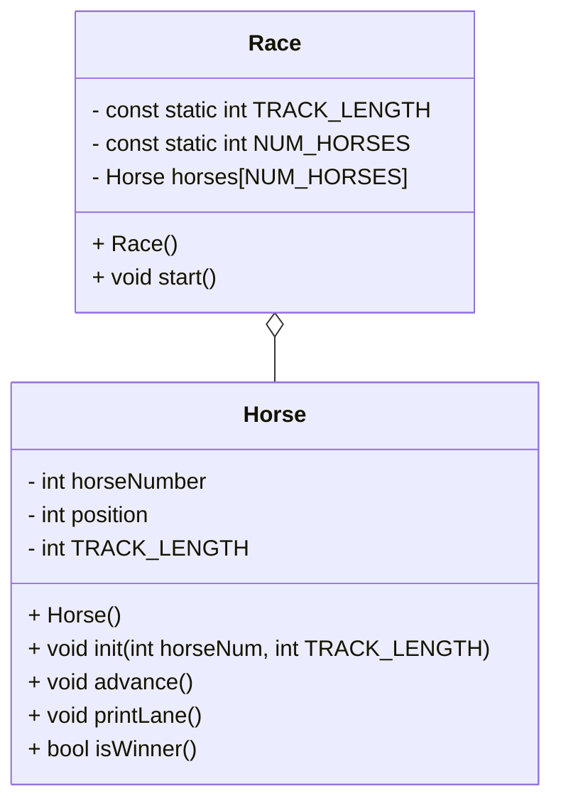

# OOP Horse Race Documentation

## Class Diagram

## Race Class

### Race()
    Create and initialize the Race object
    initialize each horse in the horses array
### start()
    while keepGoing is true
        for NUM_HORSES times with horseNum as the control variable
            call advance on horses[horseNum]
            call printLane on horses[horseNum]
            call isWinner on horses[horseNum], and if it's true
                set keepGoing to false
        ask the user for an input to go to the next turn

## Horse Class

### Horse()
    Create the Horse object
    set every variable to 0
### init(int number, int trackLength)
    set horseNum to number
    set TRACK_LENGTH to trackLength
### advance()
    create a temporary variable storing a random number (either 1 or 0)
    increase position by the random number
### printLane()
    for TRACK_LENGTH times with i as the control variable
        if i == postion
            print horseNumber to the console
        else
            print * to the console
    print a line ending to the console
### isWinner()
    if position >= TRACK_LENGTH
        return true
    else
        return false

## main()
    seed the random number generator
    call Race() to construct the race object
    call race.start() to begin the game
    return 0
