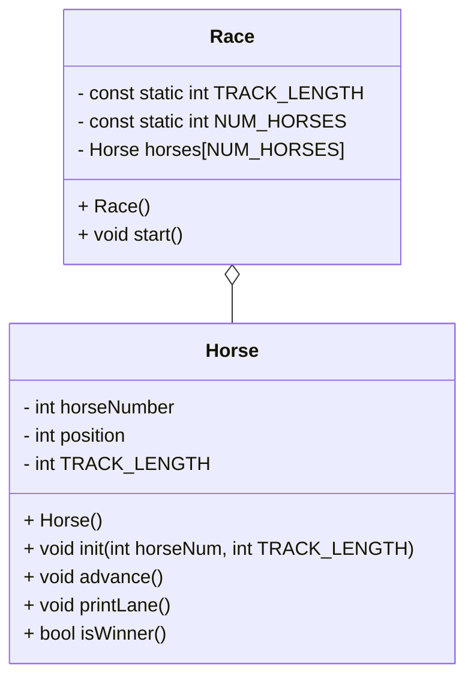

# OOP Horse Race Documentation

## Class Diagram

## Race Class

### Race()
    Create and initialize the Race object
    loop through each horse in the horses array and do the following
        initialize each horse
### start()
    loop through each horse in horses and do the following
        have each horse print it's lane to display the beginning state of the race, before any movement has occured
    while keepGoing is true
        for NUM_HORSES times with horseNum as the control variable
            call advance on horses[horseNum]
            call printLane on horses[horseNum]
            call isWinner on horses[horseNum], and if it's true
                set keepGoing to false
        ask the user for an input to go to the next turn

## Horse Class

### Horse()
    Create the Horse object
    set every variable to 0
### init(int number, int trackLength)
    set horseNum to number
    set TRACK_LENGTH to trackLength
### advance()
    create a temporary variable storing a random number (either 1 or 0)
    increase position by the random number
### printLane()
    for TRACK_LENGTH times with i as the control variable
        if i == postion
            print horseNumber to the console
        else
            print * to the console
    print a line ending to the console
### isWinner()
    if position >= TRACK_LENGTH
        return true
    else
        return false

## main()
    seed the random number generator
    call Race() to construct the race object
    call race.start() to begin the game
    return 0

## Notes About Creation
The constants for Race had to be set in the header file, as due to NUM_HORSES being used to define the size of the horses array, it would cause a compile error (I'm not sure if this is what I was supposed to do originally or if i just did something wrong, hoping the former).
